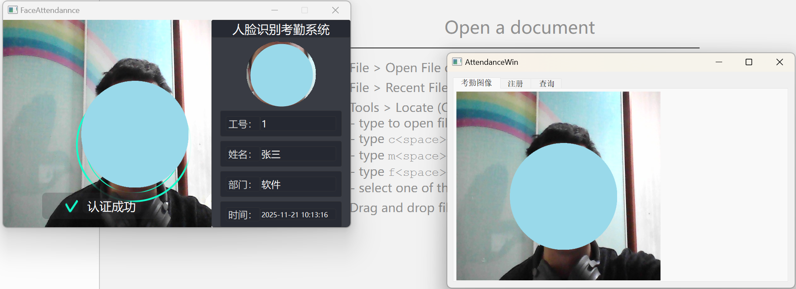
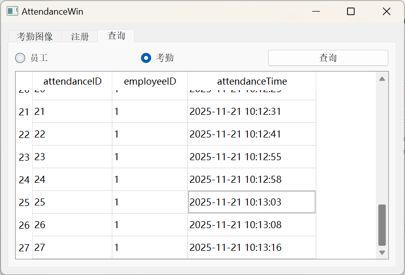

# 基于人脸识别的考勤系统
## 项目介绍 📖
基于Qt和OpenCV开发的人脸识别考勤系统，实现员工快速注册与自动考勤打卡功能。

## 项目背景 💡
传统考勤方式（如指纹打卡、卡片打卡）存在代打卡、设备易损坏等问题。本项目通过人脸识别技术，实现无人值守的智能考勤，提高考勤效率和准确性，适用于企业、学校等需要人员出勤管理的场景。

## 技术栈 🛠️
### 开发框架
1. Qt 5.15.2 + MinGW 64位 - 跨平台GUI开发框架
2. C++11 - 主要编程语言

### 技术支持
1. OpenCV 4.5.2 - 计算机视觉库，用于图像处理和人脸检测
2. SeetaFace 2.0 - 人脸识别引擎，用于人脸特征提取和匹配
3. SQLite - 轻量级数据库，存储员工信息和考勤记录
4. TCP/IP网络通信 - 客户端与服务器的数据交互

### 核心版块
| 模块名称 | 主要功能 | 技术实现 |
|---------|---------|--------|
| 人脸检测 | 实时捕获并检测人脸 | OpenCV Haar级联分类器 |
| 人脸识别 | 提取人脸特征并匹配 | SeetaFace 2.0引擎 |
| 员工管理 | 注册和存储员工信息 | SQLite数据库 |
| 考勤记录 | 记录和统计考勤数据 | TCP网络通信 |

### 项目架构
项目采用C/S架构，分为服务器端（AttendanceServer）和客户端（FaceAttendance）两个部分。服务器端负责员工信息管理、人脸识别和考勤数据存储；客户端负责摄像头实时采集和人脸检测。

## 项目功能 📋
1. 员工人脸注册 - 拍摄员工照片并提取人脸特征，关联个人信息存储到数据库
2. 实时人脸检测 - 客户端通过摄像头实时捕获视频流，检测人脸位置
3. 人脸识别考勤 - 检测到人脸后，通过TCP通信发送到服务器进行特征匹配和身份识别
4. 自动考勤记录 - 识别成功后自动记录考勤时间，并保存到数据库
5. 员工信息管理 - 服务器端提供员工信息的增删改查功能

## 项目应用方向 🔮
### 未来趋势
1. 多模态生物识别融合，提高识别准确率和安全性
2. 移动终端支持，实现手机远程考勤和管理

### 行业方向
1. 企业考勤管理，提高人力资源管理效率
2. 校园考勤系统，加强学生出勤监管

## 使用说明 🚀
### 操作流程
1. 配置环境 - 安装Qt 5.15.2、OpenCV 4.5.2和SeetaFace 2.0
2. 编译项目 - 使用Qt Creator分别编译服务器端和客户端项目
3. 启动服务器 - 运行AttendanceServer应用程序
4. 启动客户端 - 运行FaceAttendance应用程序，确保与服务器网络连接正常
5. 员工注册 - 在服务器端界面注册员工信息和人脸数据
6. 开始考勤 - 员工面对客户端摄像头，系统自动识别并记录考勤

### 配置说明
1. OpenCV配置：确保`haarcascade_frontalface_alt2.xml`分类器文件路径正确
   ```
   cascade.load("C:/opencv452/etc/haarcascades/haarcascade_frontalface_alt2.xml");
   ```

2. SeetaFace配置：确保模型文件路径正确
   ```
   seeta::ModelSetting FDmode("C:/SeetaFace/bin/model/fd_2_00.dat",seeta::ModelSetting::CPU,0);
   seeta::ModelSetting PDmode("C:/SeetaFace/bin/model/pd_2_00_pts5.dat",seeta::ModelSetting::CPU,0);
   seeta::ModelSetting FRmode("C:/SeetaFace/bin/model/fr_2_10.dat",seeta::ModelSetting::CPU,0);
   ```

3. 数据库配置：系统自动创建SQLite数据库`server.db`，存储员工信息

## 注意事项 ⚠️
- 确保摄像头连接正常且光线充足，避免逆光和暗光环境
- 首次运行需要正确配置OpenCV和SeetaFace的模型文件路径
- 网络连接不稳定时，系统具备自动重连机制，但建议在稳定网络环境下使用

## 编写项目时遇到的问题及解决方法 🛠️
### 问题一：上传照片进行测试时，ID 始终为 -1，如何处理？
**答：**
1. 检查图片路径是否包含中文或特殊字符。
2. 确认上传的照片为清晰的人脸图片。

### 问题二：程序操作数据库时总是报错，怎么办？
**答：**
先检查 SQL 语句是否正确；若修正后仍报错，可能是之前创建的数据库结构有误，导致新数据无法写入。建议删除旧数据库并重新生成。

### 问题三：修改 UI 界面后未生效，如何解决？
**答：**
删除目录中所有以 `ui_` 开头的相关生成文件，重新构建并编译运行程序即可。

   




